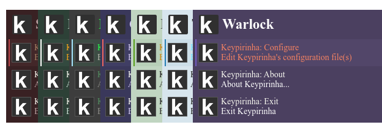

#  Keypirinha Theme Builder

A tool to create themes for the [Keypirinha](http://keypirinha.com) launcher. [Click here](https://fuhrmann.github.io/keypirinha-theme-builder/) to start creating your own themes!

## Themes

Go to the [themes](https://github.com/Fuhrmann/keypirinha-theme-builder/tree/master/themes) folder to see the current available themes.

## Share your themes

You cand send your custom theme to this repository, just follow the steps below:

1. Fork the project
2. Save your theme in the `themes` folder with a distinct name
3. Edit the `themes.json` file in the root folder and add your theme
4. Send a pull request!
